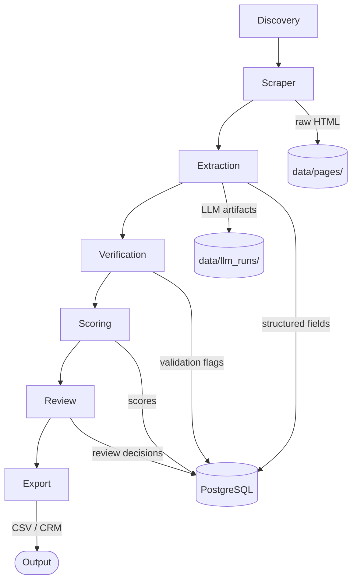

# Architecture

The lead discovery platform is a modular Python CLI pipeline. Each stage of the pipeline is an independent module with well-defined inputs and outputs, connected by an orchestration layer.

## System Overview



## Modules

| Module | Path | Responsibility |
|--------|------|----------------|
| Config | `src/config/` | Load env vars, validate settings |
| DB | `src/db/` | Engine, session factory, base |
| Models | `src/models/` | SQLAlchemy ORM definitions |
| Discovery | `src/discovery/` | Find candidate source URLs |
| Scraper | `src/scraper/` | Fetch pages, write HTML to disk |
| Extraction | `src/extraction/` | LLM-based field parsing |
| Verification | `src/verification/` | Email, phone, URL validation |
| Scoring | `src/scoring/` | Lead quality score |
| Review | `src/review/` | Human-in-the-loop approval CLI |
| Export | `src/export/` | CSV / CRM output |
| Pipeline | `src/pipeline/` | Stage orchestration |

## Storage Strategy

Two storage layers are used deliberately:

### PostgreSQL
Stores structured, queryable data only:
- Leads and their extracted fields
- Companies and sources
- Pipeline run metadata
- Verification results
- Scores and review decisions

### Local Disk
Two directories hold unstructured artifacts that are too large or too raw for the DB:

- `data/pages/` — raw HTML, named by a stable hash of the source URL
- `data/llm_runs/` — prompt/response pairs for debugging extraction

> [!important]
> Raw HTML is **never** stored in PostgreSQL. The DB holds only the path reference and metadata (URL, fetch timestamp, status code).

## Configuration

All settings come from environment variables loaded via `python-dotenv`. See [[database-schema]] for the DB connection and `.env.example` for all variables.

## CLI Entry Point

The `leads` command (defined in `pyproject.toml`) is the single entry point. Each pipeline stage exposes a sub-command:

```
leads discover
leads scrape
leads extract
leads verify
leads score
leads review
leads export
leads run      # full pipeline
```

## Related Notes

- [[pipeline]] — stage-by-stage data flow
- [[database-schema]] — table and column definitions
- [[extraction-strategy]] — LLM prompting approach
- [[scoring-model]] — how scores are calculated
- [[phase-1-plan]] — current build plan
