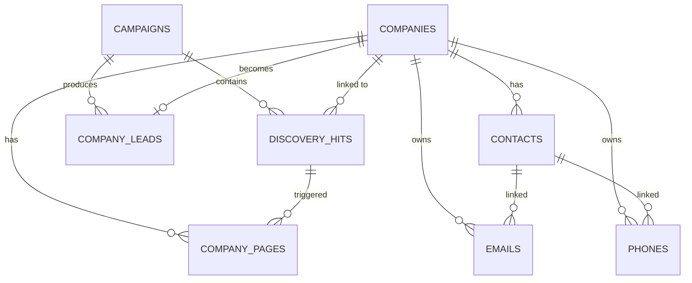

# Database Schema

All structured data is stored in PostgreSQL via SQLAlchemy ORM. Raw HTML and LLM artifacts are stored on disk — see [[architecture]] for the storage split. All schema changes go through Alembic — never alter tables manually.

## Entity Relationship



---

## Tables

### `campaigns`

A named lead-discovery initiative. All other records trace back to a campaign.

| Column | Type | Notes |
|--------|------|-------|
| `id` | UUID PK | |
| `name` | TEXT | |
| `description` | TEXT nullable | |
| `status` | `campaignstatus` enum | `draft` / `active` / `paused` / `completed` / `archived` |
| `geo_method` | `geomethod` enum | `city` / `postal_code` / `bounding_box` / `center_radius` |
| `specialty` | TEXT | e.g. `"dentists"` |
| `geo_city`, `geo_country`, `geo_postal_code` | TEXT nullable | For city / postal_code modes |
| `geo_sw_lat/lng`, `geo_ne_lat/lng` | FLOAT nullable | For bounding_box mode |
| `geo_center_lat/lng`, `geo_radius_m` | FLOAT/INT nullable | For center_radius mode |
| `created_at`, `updated_at` | TIMESTAMPTZ | Auto-managed |

---

### `discovery_hits`

One record per company URL found during discovery. Tracks the full pipeline lifecycle for that company.

| Column | Type | Notes |
|--------|------|-------|
| `id` | UUID PK | |
| `campaign_id` | UUID FK → `campaigns` | Indexed |
| `company_id` | UUID FK → `companies` nullable | Set after discovery; null until resolved |
| `source_url` | TEXT | Original URL |
| `source_type` | `discoveryhitsourcetype` enum | `google_maps` / `directory` / `manual` / `web_search` |
| `status` | `discoveryhitstatus` enum | See progressions below |
| `error_message` | TEXT nullable | Set on `failed`; cleared on success |
| `discovery_query` | TEXT nullable | Places API textQuery |
| `discovery_method` | TEXT nullable | GeoMethod value |
| `discovery_lat`, `discovery_lng` | FLOAT nullable | Query centre |
| `discovery_radius_m` | INT nullable | Query radius |
| `api_response_rank` | INT nullable | Position in Places result list |
| `discovered_at` | TIMESTAMPTZ nullable | When runner processed this result |
| `created_at`, `updated_at` | TIMESTAMPTZ | |

**Status progressions:**
```
pending   → scraped    (scraper: homepage fetched OK)
pending   → failed     (scraper: fetch error)
pending   → skipped    (scraper: no website)
scraped   → extracted  (extractor: ran, zero or more rows written)
scraped   → failed     (extractor: unhandled exception)
scraped   → skipped    (extractor: no pages found)
```

**Unique constraint:** `(campaign_id, source_url)` — same URL cannot appear twice in a campaign.

---

### `companies`

The central entity. Created by the discovery stage; enriched by scraping and extraction.

| Column | Type | Notes |
|--------|------|-------|
| `id` | UUID PK | |
| `name` | TEXT | |
| `website` | TEXT nullable | |
| `domain` | TEXT nullable | Extracted from website; indexed for dedup |
| `google_place_id` | TEXT nullable | Indexed; primary dedup key for Places sources |
| `industry` | TEXT nullable | |
| `description` | TEXT nullable | |
| `linkedin_url` | TEXT nullable | |
| `address`, `city`, `state`, `country` | TEXT nullable | |
| `employee_count` | INT nullable | |
| `founded_year` | INT nullable | |
| `extra_fields` | JSONB nullable | Overflow for source-specific metadata |
| `created_at`, `updated_at` | TIMESTAMPTZ | |

> [!note]
> Companies do **not** have `email` or `phone` columns. All contact information is in the `emails` and `phones` tables, linked via `company_id`. Query `WHERE company_id = ? AND contact_id IS NULL` to retrieve generic company-level entries.

---

### `company_pages`

A single scraped page belonging to a company. Raw HTML lives on disk; `extracted_text` is stored in the DB for querying.

| Column | Type | Notes |
|--------|------|-------|
| `id` | UUID PK | |
| `company_id` | UUID FK → `companies` | Indexed |
| `discovery_hit_id` | UUID FK → `discovery_hits` nullable | Which hit triggered this scrape |
| `url` | TEXT | Normalised URL — dedup key |
| `final_url` | TEXT nullable | URL after redirects |
| `raw_html_path` | TEXT | Relative path, e.g. `data/pages/abc123.html` |
| `http_status_code` | INT nullable | |
| `content_type` | TEXT nullable | HTTP `Content-Type` header |
| `content_hash` | VARCHAR(64) nullable | SHA-256 hex of raw HTML |
| `fetched_at` | TIMESTAMPTZ | |
| `page_type` | `pagetype` enum nullable | `homepage` / `about` / `contact` / `team` / `services` / `other` |
| `extracted_text` | TEXT nullable | Boilerplate-stripped plain text (stored in DB for querying) |
| `extracted_text_path` | TEXT nullable | Path to `.txt` artifact on disk |
| `word_count` | INT nullable | Token count of `extracted_text` |
| `created_at`, `updated_at` | TIMESTAMPTZ | |

> [!important]
> `extracted_text` is stored in PostgreSQL so downstream stages can query it directly (e.g. `WHERE word_count > 30`). The `.txt` file on disk is a supplemental artifact for LLM input and debugging.

**Dedup key:** `(company_id, url, content_hash)` — repeated scrapes of unchanged pages are no-ops.

---

### `contacts`

An individual person at a company. Populated by Phase 3 extraction.

| Column | Type | Notes |
|--------|------|-------|
| `id` | UUID PK | |
| `company_id` | UUID FK → `companies` | Indexed |
| `full_name` | TEXT nullable | Primary source of truth |
| `first_name` | TEXT nullable | Split from `full_name` if 2–4 tokens; first token |
| `last_name` | TEXT nullable | Split from `full_name` if 2–4 tokens; remaining tokens |
| `title` | TEXT nullable | Role/job title as extracted |
| `linkedin_url` | TEXT nullable | |
| `source` | TEXT nullable | e.g. `"company_page:deterministic"` or `"company_page:llm"` |
| `normalized_name_key` | TEXT nullable | Lowercased, honorific-stripped, punctuation-stripped name key. Indexed. Used for cross-run dedup. |
| `extra_fields` | JSONB nullable | |
| `created_at`, `updated_at` | TIMESTAMPTZ | |

**How contacts are populated:** See [[extraction-strategy]] — deterministic prefix+role heuristic or LLM fallback.

**Dedup:** By `(company_id, normalized_name_key)` in DB — normalised key strips honorifics, punctuation, and lowercases `full_name`. A partial unique index `(company_id, normalized_name_key) WHERE normalized_name_key IS NOT NULL` enforces uniqueness at the DB level. Added in Phase 4.1 — see [[known-risks]] E1.

---

### `emails`

An email address anchored to a company, optionally linked to a contact.

| Column | Type | Notes |
|--------|------|-------|
| `id` | UUID PK | |
| `company_id` | UUID FK → `companies` | Required; indexed |
| `contact_id` | UUID FK → `contacts` nullable | Set when linked to a person |
| `address` | TEXT | Indexed |
| `status` | `emailstatus` enum | `unverified` / `valid` / `invalid` / `catch_all` / `risky` |
| `is_primary` | BOOL | `True` for first company-level address |
| `mx_valid` | BOOL nullable | Result of MX lookup (set in Phase 4 verification) |
| `verified_at` | TIMESTAMPTZ nullable | |
| `created_at`, `updated_at` | TIMESTAMPTZ | |

**Access patterns:**
- Generic company email: `contact_id IS NULL`
- Contact personal email: `contact_id IS NOT NULL`
- All emails for a company: query by `company_id` (returns both)

**CHECK constraint:** `contact_id IS NOT NULL OR company_id IS NOT NULL` (redundant given `company_id NOT NULL`, kept for clarity).

**How emails are populated:** [[extraction-strategy]] — regex from page text, classified generic vs. named, linked by proximity.

---

### `phones`

A phone number anchored to a company, optionally linked to a contact.

| Column | Type | Notes |
|--------|------|-------|
| `id` | UUID PK | |
| `company_id` | UUID FK → `companies` | Required; indexed |
| `contact_id` | UUID FK → `contacts` nullable | Set when linked to a person |
| `number` | TEXT | E.164 format after normalisation |
| `raw_number` | TEXT nullable | Original extracted string |
| `phone_type` | `phonetype` enum | `unknown` / `mobile` / `office` / `direct` / `fax` |
| `is_primary` | BOOL | `True` for first company-level number |
| `verified_at` | TIMESTAMPTZ nullable | |
| `created_at`, `updated_at` | TIMESTAMPTZ | |

**Access patterns:**
- Company main line: `contact_id IS NULL`
- Direct dial / contact number: `contact_id IS NOT NULL`

**How phones are populated:** `phonenumbers.PhoneNumberMatcher` in extraction; re-normalised to E.164; type refined to `mobile` / `office` / `direct` in Phase 4 verification.

---

### `company_leads`

Lead lifecycle record derived from a company. Created by Phase 4 scoring after verification. One record per company (enforced by unique constraint on `company_id`).

| Column | Type | Notes |
|--------|------|-------|
| `id` | UUID PK | |
| `company_id` | UUID FK → `companies` | Unique constraint |
| `campaign_id` | UUID FK → `campaigns` nullable | Which campaign produced this lead |
| `status` | `leadstatus` enum | `new` / `qualified` / `disqualified` / `contacted` / `converted` / `churned` |
| `score` | FLOAT nullable | 0.0–100.0 |
| `score_band` | `scoreband` enum nullable | `hot` / `warm` / `cold` / `disqualified` |
| `score_details` | JSONB nullable | Per-dimension breakdown for audit |
| `review_status` | `reviewstatus` enum | `pending` / `approved` / `rejected` / `needs_edit` |
| `reviewer_notes` | TEXT nullable | |
| `review_decided_at` | TIMESTAMPTZ nullable | |
| `qualified_at`, `contacted_at`, `converted_at` | TIMESTAMPTZ nullable | Lifecycle timestamps |
| `extra_fields` | JSONB nullable | Campaign-specific or CRM metadata |
| `created_at`, `updated_at` | TIMESTAMPTZ | |

**Compound index:** `(review_status, score DESC)` — primary review queue access path.

---

### `suppression_list`

Email addresses, domains, company names, or phone numbers that should never be contacted.

| Column | Type | Notes |
|--------|------|-------|
| `id` | UUID PK | |
| `type` | `suppressiontype` enum | `email` / `domain` / `company` / `phone` |
| `value` | TEXT | The suppressed identifier |
| `reason` | `suppressionreason` enum | `unsubscribed` / `bounced` / `spam_complaint` / `do_not_contact` / `competitor` / `manual` |
| `created_at`, `updated_at` | TIMESTAMPTZ | |

Suppression is checked during scoring and review before a `CompanyLead` is presented for outreach.

---

### `audit_log`

Immutable record of INSERT / UPDATE / DELETE events on key tables.

| Column | Type | Notes |
|--------|------|-------|
| `id` | UUID PK | |
| `table_name` | TEXT | e.g. `"contacts"` |
| `record_id` | UUID | PK of affected row |
| `action` | `auditaction` enum | `INSERT` / `UPDATE` / `DELETE` |
| `old_data` | JSONB nullable | Row state before change |
| `new_data` | JSONB nullable | Row state after change |
| `created_at` | TIMESTAMPTZ | |

---

## PostgreSQL Enum Types

| Enum type | Values |
|-----------|--------|
| `campaignstatus` | `draft`, `active`, `paused`, `completed`, `archived` |
| `discoveryhitstatus` | `pending`, `scraped`, `extracted`, `failed`, `skipped` |
| `discoveryhitsourcetype` | `google_maps`, `directory`, `manual`, `web_search` |
| `geomethod` | `city`, `postal_code`, `bounding_box`, `center_radius` |
| `pagetype` | `homepage`, `about`, `contact`, `team`, `services`, `other` |
| `emailstatus` | `unverified`, `valid`, `invalid`, `catch_all`, `risky` |
| `phonetype` | `mobile`, `office`, `direct`, `fax`, `unknown` |
| `leadstatus` | `new`, `qualified`, `disqualified`, `contacted`, `converted`, `churned` |
| `scoreband` | `hot`, `warm`, `cold`, `disqualified` |
| `reviewstatus` | `pending`, `approved`, `rejected`, `needs_edit` |
| `suppressiontype` | `email`, `domain`, `company`, `phone` |
| `suppressionreason` | `unsubscribed`, `bounced`, `spam_complaint`, `do_not_contact`, `competitor`, `manual` |
| `auditaction` | `INSERT`, `UPDATE`, `DELETE` |

---

## Key Indexes

| Table | Index | Purpose |
|-------|-------|---------|
| `campaigns` | `status` | Filter active campaigns |
| `discovery_hits` | `campaign_id` | Load hits for campaign |
| `discovery_hits` | `status` | Find pending/scraped hits |
| `discovery_hits` | `company_id` | Link hit to company |
| `companies` | `domain` | Dedup by domain |
| `companies` | `google_place_id` | Dedup by Places ID |
| `company_pages` | `company_id` | Load pages for extraction |
| `company_pages` | `page_type` | Filter by page classification |
| `contacts` | `company_id` | Load contacts for scoring |
| `contacts` | `normalized_name_key` | Fast lookup by normalised key |
| `contacts` | `(company_id, normalized_name_key) WHERE NOT NULL` | Partial unique index — cross-run dedup |
| `emails` | `company_id` | Load emails for verification |
| `emails` | `address` | Dedup and suppression lookup |
| `emails` | `contact_id` | Join contact → emails |
| `phones` | `company_id` | Load phones for verification |
| `phones` | `contact_id` | Join contact → phones |
| `company_leads` | `company_id` | 1:1 enforcement (unique) |
| `company_leads` | `(review_status, score DESC)` | Review queue ordering |
| `company_leads` | `status` | Pipeline status filter |

---

## Migrations

All schema changes go through Alembic. Never alter tables manually.

```bash
alembic revision --autogenerate -m "describe change"
alembic upgrade head
```

---

## Related Notes

- [[architecture]] — why raw HTML stays off-database
- [[pipeline]] — how each stage writes to these tables
- [[extraction-strategy]] — how `contacts`, `emails`, `phones` are populated
- [[extraction-pipeline]] — detailed extraction data flow
- [[scraper-design]] — how `company_pages` is populated
- [[scoring-model]] — how `company_leads.score` is computed
