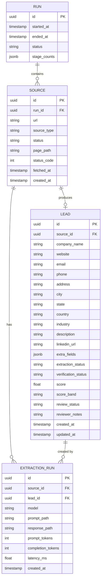

# Database Schema

All structured data is stored in PostgreSQL via SQLAlchemy ORM. Raw HTML and LLM artifacts are stored on disk — see [[architecture]] for the storage split.

## Entity Relationship



## Tables

### `run`

Tracks a single pipeline execution.

| Column | Type | Notes |
|--------|------|-------|
| `id` | UUID PK | Auto-generated |
| `started_at` | TIMESTAMP | When the run began |
| `ended_at` | TIMESTAMP | Null until complete |
| `status` | VARCHAR | `running`, `completed`, `failed` |
| `stage_counts` | JSONB | `{stage: {attempted, succeeded, failed}}` |

---

### `source`

A URL to be or already scraped.

| Column | Type | Notes |
|--------|------|-------|
| `id` | UUID PK | |
| `run_id` | UUID FK → `run` | Which run discovered this |
| `url` | TEXT | Unique per run |
| `source_type` | VARCHAR | `google_maps`, `directory`, `manual`, etc. |
| `status` | VARCHAR | `pending`, `fetched`, `failed` |
| `page_path` | TEXT | Relative path to HTML on disk |
| `status_code` | INT | HTTP response code |
| `fetched_at` | TIMESTAMP | |
| `created_at` | TIMESTAMP | |

> [!note]
> `page_path` stores a relative path like `data/pages/abc123.html`. The HTML content itself is never stored in the DB.

---

### `lead`

One extracted lead per source (1:1 in normal flow).

| Column | Type | Notes |
|--------|------|-------|
| `id` | UUID PK | |
| `source_id` | UUID FK → `source` | |
| `company_name` | TEXT | |
| `website` | TEXT | |
| `email` | TEXT | |
| `phone` | TEXT | Stored in E.164 format after verification |
| `address` | TEXT | |
| `city` | TEXT | |
| `state` | TEXT | |
| `country` | TEXT | Default: inferred from source |
| `industry` | TEXT | |
| `description` | TEXT | Short company description |
| `linkedin_url` | TEXT | |
| `extra_fields` | JSONB | Overflow for source-specific fields |
| `extraction_status` | VARCHAR | `pending`, `extracted`, `failed` |
| `verification_status` | VARCHAR | `pending`, `verified`, `partial`, `failed` |
| `score` | FLOAT | 0.0–100.0 |
| `score_band` | VARCHAR | `hot`, `warm`, `cold`, `disqualified` |
| `review_status` | VARCHAR | `pending`, `approved`, `rejected`, `needs_edit` |
| `reviewer_notes` | TEXT | Optional human notes |
| `created_at` | TIMESTAMP | |
| `updated_at` | TIMESTAMP | Auto-updated |

---

### `extraction_run`

Metadata about each LLM call. The actual prompts and responses are on disk.

| Column | Type | Notes |
|--------|------|-------|
| `id` | UUID PK | |
| `source_id` | UUID FK → `source` | |
| `lead_id` | UUID FK → `lead` | Null if extraction failed |
| `model` | VARCHAR | e.g. `gpt-4o` |
| `prompt_path` | TEXT | Relative path to `data/llm_runs/` |
| `response_path` | TEXT | Relative path to `data/llm_runs/` |
| `prompt_tokens` | INT | |
| `completion_tokens` | INT | |
| `latency_ms` | FLOAT | |
| `created_at` | TIMESTAMP | |

---

## Status Progressions

```
source.status:       pending → fetched → failed
lead.extraction_status:  pending → extracted → failed
lead.verification_status: pending → verified | partial | failed
lead.review_status:  pending → approved | rejected | needs_edit
```

## Indexes

- `source(run_id)` — filter sources by run
- `source(status)` — find pending sources quickly
- `lead(source_id)` — join source → lead
- `lead(review_status, score)` — review queue ordering
- `lead(email)` — deduplication lookups

## Migrations

All schema changes go through Alembic. Never alter tables manually.

```bash
alembic revision --autogenerate -m "describe change"
alembic upgrade head
```

## Related Notes

- [[architecture]] — why raw HTML stays off-database
- [[pipeline]] — how each stage writes to these tables
- [[extraction-strategy]] — what fields are extracted and how
