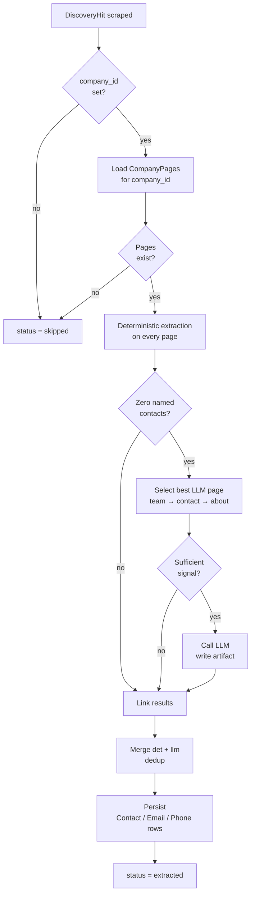
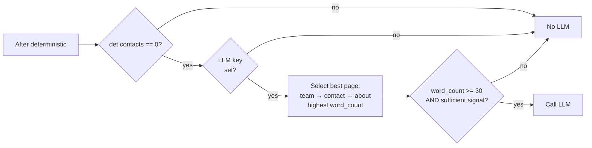

# Extraction Pipeline

Detailed module map and data flow for Phase 3. For the prompting and classification rules see [[extraction-strategy]]. For schema details see [[database-schema]].

## Module Map

| Module | Path | Responsibility |
|--------|------|----------------|
| Models | `src/extraction/models.py` | Internal dataclasses: `RawContact`, `RawEmail`, `RawPhone`, `ExtractionResult`; `normalize_name_key()`; `split_name()` |
| Deterministic | `src/extraction/deterministic.py` | Regex email, phonenumbers parse, prefix+role name detection; page-type gating |
| LLM | `src/extraction/llm.py` | `LLMClient` protocol; `AnthropicClient`; prompt builder; JSON schema parse; artifact writer |
| Linker | `src/extraction/linker.py` | Merges per-page results; marks footer emails as generic; page-local proximity logic |
| Merge | `src/extraction/merge.py` | Deduplicates contacts/emails/phones across deterministic and LLM results |
| Persist | `src/extraction/persist.py` | Query-before-insert dedup; writes `Contact`, `Email`, `Phone` ORM rows |
| Runner | `src/extraction/runner.py` | `ExtractionSummary`; `_extract_hit()`; `run_extraction_for_campaign()` |
| Re-export | `src/extraction/extraction.py` | Public surface: `run_extraction_for_campaign`, `ExtractionSummary` |

## Per-Hit Workflow



## Internal Data Model

`ExtractionResult` is a pure in-memory transfer object — it never touches the DB:

```
ExtractionResult
├── contacts: list[RawContact]
│   ├── full_name       (str)
│   ├── title           (str | None)
│   ├── email           (str | None)   ← contact-level, pre-link
│   ├── phone           (str | None)   ← contact-level, pre-link
│   ├── source_page_type (str | None)
│   └── extraction_method ("deterministic" | "llm")
├── emails: list[RawEmail]
│   ├── address
│   ├── is_generic      (True = company-level)
│   ├── contact_full_name (str | None)  ← linking hint
│   ├── source_page_type
│   └── extraction_method
└── phones: list[RawPhone]
    ├── e164            (E.164 string)
    ├── raw             (original string)
    ├── contact_full_name
    ├── source_page_type
    └── extraction_method
```

## Name Normalisation

`normalize_name_key(full_name)` is used everywhere a contact name must be compared:

1. Strip honorifics: `dr`, `mr`, `mrs`, `ms`, `prof`, `rev`, `sir` (whole-word, case-insensitive)
2. Strip punctuation (everything that is not `\w` or whitespace)
3. Lowercase
4. Collapse whitespace

`"Dr. John Smith"` → `"john smith"` · `"Mrs. Jane O'Brien"` → `"jane obrien"`

## Name Splitting

`split_name(full_name)` returns `(first_name, last_name)` for 2–4 token names only:

- First token → `first_name`
- Remaining tokens joined → `last_name`
- 1-token or 5+ token names → `(None, None)`

`full_name` is always the primary source of truth. `first_name`/`last_name` are supplemental for CRM compatibility.

## LLM Trigger Decision



Sufficient signal = page contains ≥1 of: email address, parseable phone, capitalised two-word phrase.

## Linking Rules

1. **Footer rule** — any email or phone inside `<footer>` or element with class/id matching `footer|site-footer|bottom|colophon` → `is_generic = True`, `contact_full_name = None`
2. **Generic rule** — `is_generic` emails skip linking entirely → always `contact_id = NULL`
3. **Page-local proximity** — within a page's `extracted_text`, link email/phone to nearest contact within 300 chars
4. **Broaden** — still-unlinked items → company-level (`contact_id = NULL`); never cross-page linked

## Persist Dedup Strategy

| Entity | Dedup key | Behaviour on match |
|--------|-----------|-------------------|
| `Contact` | `(company_id, full_name)` in DB + `normalize_name_key` in-run dict | Skip insertion |
| `Email` | `(company_id, address)` | Skip insertion |
| `Phone` | `(company_id, number)` (E.164) | Skip insertion |

Phones from LLM are re-normalised through `phonenumbers.parse()` before dedup and insertion. Unnormalisable strings are skipped with a `DEBUG` log.

## ExtractionSummary Fields

| Field | Meaning |
|-------|---------|
| `hits_processed` | Total hits attempted |
| `hits_with_data` | Hits where ≥1 row was written |
| `hits_zero_data` | Hits that ran cleanly but produced nothing |
| `hits_failed` | Hits that raised an unhandled exception |
| `hits_skipped` | Hits with no pages or no company |
| `contacts_created` | New `Contact` rows inserted |
| `emails_created` | New `Email` rows inserted |
| `phones_created` | New `Phone` rows inserted |
| `errors` / `error_details` | Count and messages from failed hits |

## Related Notes

- [[extraction-strategy]] — prompting rules, classification thresholds, LLM schema
- [[scraper-design]] — how `CompanyPage.extracted_text` is produced
- [[database-schema]] — `contacts`, `emails`, `phones`, `discovery_hits`
- [[known-risks]] — contact dedup cross-run gap and other known limitations
