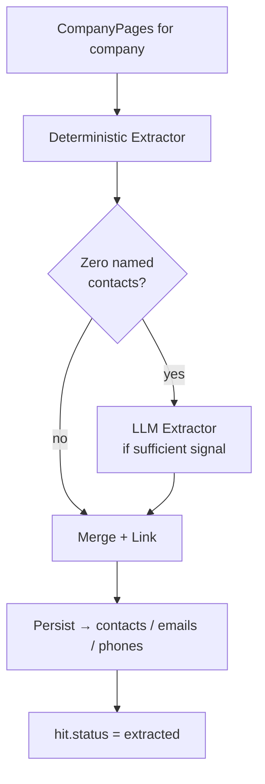

# Extraction Strategy

Phase 3 of the [[pipeline]]. For each `DiscoveryHit` with status `scraped`, the extractor reads the company's scraped pages from PostgreSQL and produces `Contact`, `Email`, and `Phone` rows.

See [[extraction-pipeline]] for the module map and data flow. See [[database-schema]] for how results are stored.

## Two-Layer Approach

Extraction runs two complementary strategies in sequence. Neither overwrites the other's results — they accumulate into a shared pool that is merged and linked.



### Layer 1 — Deterministic

Runs on **all pages** for the company. Uses regex and the `phonenumbers` library. No LLM, no network calls.

**Emails** — RFC 5322 pattern. Classified as:
- **Generic** (`info@`, `contact@`, `reception@`, `appointments@`, etc.) → persisted as company-level `Email` rows with `contact_id = NULL`
- **Named** (all other local parts) → held as contact candidates, linked in the merge step

**Phones** — `phonenumbers.PhoneNumberMatcher` with country hint from `company.country` (default `"GB"`). Only `is_valid_number()` results accepted; stored as E.164 in `Phone.number`, raw string in `Phone.raw_number`.

**Named contacts** — prefix + role heuristic, page-type gated:

| Page type | Acceptance rule |
|-----------|----------------|
| `team`, `contact` | Title prefix alone sufficient |
| `about`, `homepage` | Prefix **and** role keyword both required |
| `services`, `other` | Contacts skipped; emails/phones still extracted |

Title prefixes: `Dr`, `Mr`, `Mrs`, `Ms`, `Prof`, `Rev`.
Role keywords: `Dentist`, `Hygienist`, `Therapist`, `Nurse`, `Principal`, `Practice Manager`, `Receptionist`, `Director`, `Partner`, `Associate`, `Owner`, `Founder`, `Manager`, `Consultant`, `Specialist`, `Coordinator`, `Practitioner`, `Surgeon`, and several dental specialties.

### Layer 2 — LLM Fallback

Triggered **only** when all of the following are true after deterministic extraction:

1. Zero named contacts found across all pages
2. At least one `team` or `contact` page (or `about` as fallback) has **sufficient signal** — at least one email, valid phone, or capitalised two-word phrase in `extracted_text`
3. The selected page's `word_count ≥ 30`

**Provider:** Anthropic, model configured via `EXTRACTION_MODEL` (default `claude-3-5-haiku-20241022`).

**Page selection priority:** `team` (highest word_count) → `contact` (highest word_count) → `about`.

**LLM output schema:**

```json
{
  "contacts": [
    {"full_name": "string|null", "title": "string|null", "email": "string|null", "phone": "string|null"}
  ],
  "company_emails": ["string", ...],
  "company_phones": ["string", ...]
}
```

`company_emails` and `company_phones` are **arrays** — multiple generic addresses and main-line numbers are supported.

**On malformed response:** log `WARNING`, write raw artifact to `data/llm_runs/<run_id>.json` with `"status": "malformed"`, return `None`. LLM failure is never a hit failure.

## Merge and Link

After deterministic and LLM results are collected:

1. **Dedup contacts** — by `normalize_name_key(full_name)`: lowercase, strip honorifics (`dr`, `mr`, `mrs`, `ms`, `prof`, `rev`, `sir`), strip punctuation, normalise whitespace
2. **Dedup emails** — by lowercased address
3. **Dedup phones** — by E.164 number
4. **Footer rule** — emails found in footer HTML elements are always company-level regardless of proximity to names
5. **Page-local proximity** — link named email/phone to the nearest contact within 300 characters; nothing is linked across pages
6. **Broaden to company-level** — any remaining unlinked email/phone becomes a company-level row (`contact_id = NULL`)

## Persistence

All results write into existing tables — no new tables introduced in Phase 3.

**`contacts`** row fields set during extraction:
- `full_name` — always set; primary source of truth
- `first_name` / `last_name` — set via conservative split for 2–4 token names (first token → `first_name`, remainder → `last_name`); `null` for 1-token or 5+ token names
- `title` — role text found near the name
- `source` — `"company_page:deterministic"` or `"company_page:llm"`

**`emails`** row: `company_id` always set; `contact_id` set only if linked; `status = UNVERIFIED`; `is_primary = True` for the first company-level email if none previously existed.

**`phones`** row: `company_id` always set; `contact_id` set if linked; `number` in E.164; `phone_type = UNKNOWN` (refined in verification); `is_primary = True` for the first company-level phone.

**Dedup before insert:** `SELECT WHERE company_id=? AND address=?` for emails; `SELECT WHERE company_id=? AND number=?` for phones; `SELECT WHERE company_id=? AND normalized_name_key=?` for contacts (normalised key strips honorifics, punctuation, lowercases; supplemented by in-run normalized-key dict). The partial unique index `(company_id, normalized_name_key) WHERE NOT NULL` enforces uniqueness at the DB level. Added in Phase 4.1 — fixes cross-run dedup gap (E1).

## Status Transitions

```
scraped  →  extracted   any contacts/emails/phones written, or clean run with zero results
scraped  →  failed      unhandled exception / DB error
scraped  →  skipped     company has no scraped pages
```

LLM failure (`malformed` or `error` artifact) does **not** change the hit to `failed`. It is non-fatal — the hit transitions to `extracted` on whatever deterministic results were found.

## Debug Artifacts

Every LLM call (successful or not) writes `data/llm_runs/<run_id>.json`:

```json
{
  "run_id": "uuid",
  "company_id": "uuid",
  "page_id": "uuid",
  "page_type": "team",
  "status": "ok | malformed | error",
  "prompt": "...",
  "response": "...",
  "error": "optional error message"
}
```

Artifacts are gitignored and stay local. No DB table records LLM runs — the filesystem is the audit trail.

## Configuration

| Variable | Default | Description |
|----------|---------|-------------|
| `ANTHROPIC_API_KEY` | — | Required to enable LLM extraction |
| `EXTRACTION_MODEL` | `claude-3-5-haiku-20241022` | Anthropic model name |
| `EXTRACTION_MAX_TOKENS` | `1024` | Max response tokens |

If `ANTHROPIC_API_KEY` is absent, the LLM layer is silently disabled and extraction runs deterministic-only.

## CLI

```
leads extract --campaign-id <uuid>
```

Processes all `scraped` hits for the campaign. Exits 0 when `errors == 0`, exits 1 otherwise. Prints a Rich summary table on completion showing hits processed, hits with data, hits with zero data, hits failed, hits skipped, and row counts for contacts/emails/phones created.

## Related Notes

- [[extraction-pipeline]] — module map and internal data flow
- [[pipeline]] — stage overview
- [[database-schema]] — `contacts`, `emails`, `phones` table definitions
- [[scraper-design]] — how `extracted_text` is produced
- [[known-risks]] — known limitations and planned improvements
