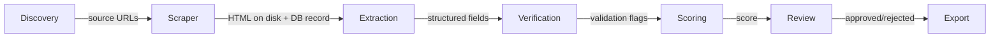

# Pipeline

The pipeline is a linear sequence of stages. Each stage reads from and writes to PostgreSQL, except the Scraper which writes raw HTML to disk.

See [[architecture]] for how storage layers are divided.

## Stage Flow

## Stages

### 1. Discovery

**Input:** Seed configuration (industry filters, geography, source types)
**Process:** Locate candidate URLs — could be directory listings, search results, or known data sources
**Output:** `Source` records inserted into PostgreSQL
**Storage:** DB only

Discovery is intentionally pluggable. Different source adapters (Google Maps, LinkedIn, industry directories) implement the same interface.

---

### 2. Scraper

**Input:** `Source` records with status `pending`
**Process:**
1. Fetch the page (HTTP GET with retry/backoff)
2. Write raw HTML to `data/pages/<hash>.html`
3. Update `Source` record with `page_path`, `fetched_at`, `status_code`

**Output:** HTML file on disk; updated `Source` record
**Storage:** Disk (`data/pages/`) + DB metadata

> [!note]
> The scraper stores only the path in the DB, never the HTML content itself.

---

### 3. Extraction

**Input:** `Source` record + HTML file from disk
**Process:**
1. Read HTML from disk
2. Build LLM prompt (system + user message with HTML snippet)
3. Call LLM, request structured JSON output
4. Write prompt + raw response to `data/llm_runs/<run_id>.json`
5. Parse response into a `Lead` record

**Output:** `Lead` record in DB; LLM artifact on disk
**Storage:** DB (parsed fields) + Disk (`data/llm_runs/`)

See [[extraction-strategy]] for prompt design and field definitions.

---

### 4. Verification

**Input:** `Lead` records with status `extracted`
**Process:** Validate individual fields:
- Email format and MX record lookup
- Phone number parsing (E.164 normalization)
- URL reachability check
- Deduplication against existing leads

**Output:** Validation flags written back to the `Lead` record
**Storage:** DB

---

### 5. Scoring

**Input:** Verified `Lead` records
**Process:** Compute a quality score (0–100) from field completeness, verification results, and source quality
**Output:** `score` and `score_band` written to `Lead`
**Storage:** DB

See [[scoring-model]] for criteria and weights.

---

### 6. Review

**Input:** Scored `Lead` records above a minimum score threshold
**Process:** Present leads to a human reviewer via CLI (or future UI). Reviewer marks each as `approved`, `rejected`, or `needs-edit`
**Output:** `review_status` and optional `reviewer_notes` written to `Lead`
**Storage:** DB

---

### 7. Export

**Input:** `Lead` records with `review_status = approved`
**Process:** Render to output format (CSV, JSON, CRM payload)
**Output:** File or API call
**Storage:** External

---

## Run Metadata

Every pipeline execution creates a `Run` record that tracks:

- Start/end time
- Stage reached
- Counts per stage (attempted, succeeded, failed)
- Any fatal errors

This allows replaying failed runs from the stage that failed.

## CLI Commands

| Command | Description |
|---------|-------------|
| `leads create-campaign` | Create a new campaign with geo targeting |
| `leads run-discovery` | Run Google Places discovery for a campaign |
| `leads scrape` | Fetch and persist pages for pending discovery hits |
| `leads extract` | Run deterministic + LLM extraction on scraped pages |
| `leads verify` | Validate email, phone, and URL fields |
| `leads score` | Compute lead quality scores |
| `leads review` | Interactive human review (approve / reject / edit / skip) |
| `leads export` | Export approved leads to three CSV files |
| `leads run` | Run pipeline stages discover→score in one command |
| `leads mark-contacted` | Transition a lead from QUALIFIED to CONTACTED |
| `leads mark-converted` | Transition a lead from CONTACTED to CONVERTED |
| `leads mark-churned` | Transition a lead from CONTACTED or CONVERTED to CHURNED |

### Stage flow clarification

`leads run` covers only the automated pipeline stages: **discover → scrape → extract → verify → score**.

Review and export are **separate explicit actions** that require human involvement:
- `leads review` — interactive review loop; must be run after scoring
- `leads export` — produces timestamped CSV files from APPROVED leads; must be run after review

## Related Notes

- [[architecture]] — module map and storage strategy
- [[extraction-strategy]] — LLM prompting details
- [[scoring-model]] — scoring criteria
- [[database-schema]] — table definitions for Run, Source, Lead
- [[export-design]] — export types, suppression rules, outreach tracking
