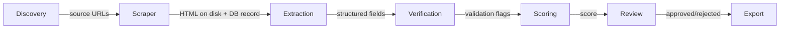

# Pipeline

The pipeline is a linear sequence of stages. Each stage reads from and writes to PostgreSQL, except the Scraper which writes raw HTML to disk.

See [[architecture]] for how storage layers are divided.

## Stage Flow



## Stages

### 1. Discovery

**Input:** Campaign configuration (industry, geography, search queries, platform)
**Process:** Locate candidate companies via one of two tracks:
- **Google Places** (`discovery_source = places`) — local businesses via Places API
- **Web Search** (`discovery_source = web_search`) — online brands via Serper.dev (100 results/query, recommended) or DuckDuckGo (free, ~10 results/query)

**Output:** `Company` + `DiscoveryHit` records inserted into PostgreSQL
**Storage:** DB only

For Shopify campaigns, discovery also fetches `/products.json` to enrich `company.extra_fields` with product count and price range. See [[ecommerce-discovery]] for the full Shopify flow.

---

### 2. Scraper

**Input:** `Source` records with status `pending`
**Process:**
1. Fetch the page (HTTP GET with retry/backoff)
2. Write raw HTML to `data/pages/<hash>.html`
3. Update `Source` record with `page_path`, `fetched_at`, `status_code`

**Output:** HTML file on disk; updated `Source` record
**Storage:** Disk (`data/pages/`) + DB metadata

> [!note]
> The scraper stores only the path in the DB, never the HTML content itself.

---

### 3. Extraction

**Input:** `DiscoveryHit` records with status `scraped` + HTML files from disk
**Process:**
1. Run deterministic regex extraction (emails, phones, URLs) on all saved pages
2. If no contacts found, try LLM extraction on the best available page (TEAM → CONTACT → ABOUT)
3. LLM provider: **Ollama** (local, `qwen2.5:7b` recommended) or **Anthropic API** fallback
4. Write prompt + raw response to `data/llm_runs/<run_id>.json`
5. Merge deterministic + LLM results; persist contacts, emails, phones to DB

**Output:** `Contact`, `Email`, `Phone` records in DB; LLM artifact on disk
**Storage:** DB (parsed fields) + Disk (`data/llm_runs/`)

LLM is only triggered when deterministic extraction finds zero contacts, so most runs use it for a small fraction of pages. See [[extraction-pipeline]] for details.

Configure in `.env`:
```
OLLAMA_BASE_URL=http://<machine>:11434
OLLAMA_MODEL=qwen2.5:7b   # recommended — reliable JSON, fast
ANTHROPIC_API_KEY=...      # fallback if Ollama not available
```

---

### 4. Verification

**Input:** `Lead` records with status `extracted`
**Process:** Validate individual fields:
- Email format and MX record lookup
- Phone number parsing (E.164 normalization)
- URL reachability check
- Deduplication against existing leads

**Output:** Validation flags written back to the `Lead` record
**Storage:** DB

---

### 5. Scoring

**Input:** Verified `CompanyLead` records + saved HTML pages
**Process:**
1. Detect **AEO signals** from saved HTML (JSON-LD, schema type, viewport, OG tags, HTTPS)
2. Detect **tech signals** from saved HTML (Google Ads, Meta Pixel, GA4, TikTok Pixel, CMS, chat, blog, FAQ, cookie banner)
3. Compute a quality score from 7 dimensions (A–G): contact richness, channel availability, verification quality, scrape quality, location, AEO opportunity, tech gap
4. Assign a score band: HOT / WARM / COLD / DISQUALIFIED

**Output:** `score`, `score_band`, and `score_details` (JSON breakdown) written to `CompanyLead`
**Storage:** DB

Both AEO and tech signal detection are pure HTML parsing — no network calls, milliseconds per company. See [[scoring-model]] for dimension weights.

---

### 6. Review

**Input:** Scored `Lead` records above a minimum score threshold
**Process:** Present leads to a human reviewer via CLI (or future UI). Reviewer marks each as `approved`, `rejected`, or `needs-edit`
**Output:** `review_status` and optional `reviewer_notes` written to `Lead`
**Storage:** DB

---

### 7. Export

**Input:** `Lead` records with `review_status = approved`
**Process:** Render to output format (CSV, JSON, CRM payload)
**Output:** File or API call
**Storage:** External

---

## Run Metadata

Every pipeline execution creates a `Run` record that tracks:

- Start/end time
- Stage reached
- Counts per stage (attempted, succeeded, failed)
- Any fatal errors

This allows replaying failed runs from the stage that failed.

## CLI Commands

| Command | Description |
|---------|-------------|
| `leads create-campaign` | Create a new campaign with geo targeting |
| `leads run-discovery` | Run Google Places discovery for a campaign |
| `leads scrape` | Fetch and persist pages for pending discovery hits |
| `leads extract` | Run deterministic + LLM extraction on scraped pages |
| `leads verify` | Validate email, phone, and URL fields |
| `leads score` | Compute lead quality scores |
| `leads review` | Interactive human review (approve / reject / edit / skip) |
| `leads export` | Export approved leads to three CSV files |
| `leads run` | Run pipeline stages discover→score in one command |
| `leads mark-contacted` | Transition a lead from QUALIFIED to CONTACTED |
| `leads mark-converted` | Transition a lead from CONTACTED to CONVERTED |
| `leads mark-churned` | Transition a lead from CONTACTED or CONVERTED to CHURNED |

### Stage flow clarification

`leads run` covers only the automated pipeline stages: **discover → scrape → extract → verify → score**.

Review and export are **separate explicit actions** that require human involvement:
- `leads review` — interactive review loop; must be run after scoring
- `leads export` — produces timestamped CSV files from APPROVED leads; must be run after review

## Related Notes

- [[architecture]] — module map and storage strategy
- [[extraction-strategy]] — LLM prompting details
- [[scoring-model]] — scoring criteria
- [[database-schema]] — table definitions for Run, Source, Lead
- [[export-design]] — export types, suppression rules, outreach tracking
