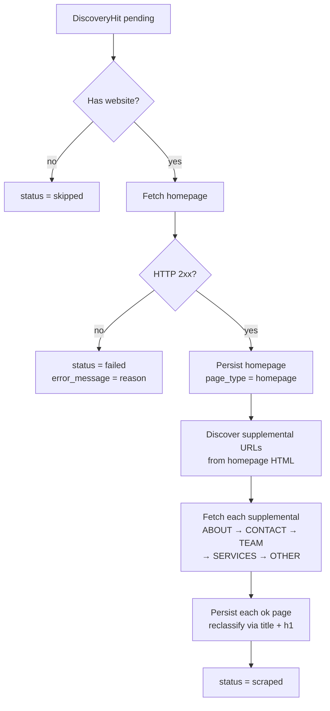

# Scraper Design

Phase 2 of the [[pipeline]]. For each `DiscoveryHit` with status `pending`, the scraper fetches the company's homepage, discovers supplemental pages, extracts clean text, and persists everything to disk and PostgreSQL.

## Module Map

| Module | Path | Responsibility |
|--------|------|----------------|
| Utils | `src/scraper/utils.py` | `normalize_url()` — canonical URL form for dedup |
| Fetcher | `src/scraper/fetcher.py` | HTTP GET with robots.txt, rate limiting, timeouts |
| Classifier | `src/scraper/classifier.py` | Label each page: homepage / about / contact / team / services / other |
| Text extractor | `src/scraper/text_extractor.py` | HTML → plain text via trafilatura + BS4 fallback |
| Page finder | `src/scraper/page_finder.py` | Discover supplemental URLs from homepage's internal links |
| Persist | `src/scraper/persist.py` | Dedup + write HTML to disk + insert `CompanyPage` row |
| Runner | `src/scraper/runner.py` | Orchestrate per-hit workflow; update hit status |

## Per-Hit Workflow



Supplemental fetch failures are non-fatal — a partial result still transitions the hit to `scraped`.

## Page Classification

Two classifiers are layered:

**`classify_url(url)`** — URL-path-only heuristic, runs before any fetch.

**`classify_page(url, title, h1)`** — adds page `<title>` and first `<h1>` text. Used after fetching to reclassify supplemental pages with more precision. Falls back to URL classification.

Priority order within each classifier (ABOUT checked before TEAM, etc.) is fixed — earlier types win on overlap.

| Type | Example URL signals | Example text signals |
|------|--------------------|--------------------|
| `homepage` | `/`, empty path | — |
| `about` | `/about`, `/about-us`, `/our-story`, `/our-practice` | "About Our Practice", "Who We Are" |
| `contact` | `/contact`, `/find-us`, `/appointments` | "Contact Us", "Book an Appointment" |
| `team` | `/team`, `/meet-the-team`, `/our-team`, `/staff` | "Meet the Team", "Our Dentists" |
| `services` | `/services`, `/treatments`, `/implants` | "Dental Care", "What We Do" |
| `other` | everything else | — |

## Supplemental Page Selection

`find_supplemental_urls()` extracts all same-origin, non-media `<a href>` links from the homepage HTML and returns at most one URL per `PageType`, selected by **shortest URL path** (most direct page on the site).

Priority: **ABOUT → CONTACT → TEAM** (preferred), then SERVICES → OTHER (fallbacks). No URL is reused across types.

## URL Normalisation

`normalize_url(url)` produces a canonical form for use as the dedup key:

- Lowercase scheme and host
- Strip default ports (80 for http, 443 for https)
- Strip query string and fragment
- Strip trailing slash from non-root paths (`/about/` → `/about`, `/` kept)

## Deduplication

`save_page()` checks for an existing `CompanyPage` row where:

```
company_id = ? AND url = normalize_url(final_url) AND content_hash = ?
```

If the row exists with the same hash, it is returned unchanged (no-op). If the URL exists but the hash differs, a new row is inserted (content updated). This means repeated scrapes of unchanged pages are cheap — no disk writes, no new rows.

## Storage

### Disk (`data/pages/`)

| File | Content | Name |
|------|---------|------|
| `<sha256>.html` | Raw HTML bytes | SHA-256 hex of HTML |
| `<sha256>.txt` | Extracted plain text | Same hash as the HTML |

### PostgreSQL (`company_pages`)

| Column | Description |
|--------|-------------|
| `url` | Normalised URL (dedup key) |
| `final_url` | URL after redirects (if different) |
| `raw_html_path` | Relative path to `.html` file on disk |
| `content_hash` | SHA-256 hex for change detection |
| `http_status_code` | HTTP response code |
| `content_type` | `Content-Type` header value |
| `page_type` | `PageType` enum value |
| `extracted_text` | Boilerplate-stripped plain text (**in DB**, queryable) |
| `extracted_text_path` | Relative path to `.txt` file on disk |
| `word_count` | Token count of `extracted_text` |
| `fetched_at` | UTC timestamp of fetch |

> [!important]
> `extracted_text` is stored **in PostgreSQL** so it can be queried directly (e.g. `WHERE word_count > 100`). The `.txt` file on disk is a supplemental artifact for debugging and LLM input in Phase 3.

## Text Extraction

`extract_text(html)` pipeline:

1. **trafilatura** — boilerplate-aware extraction tuned for editorial and business-page content. Returns stripped prose, ignoring navigation, footers, and ads.
2. **BeautifulSoup fallback** — if trafilatura returns empty or raises, BS4 strips all tags (removing `<script>` and `<style>` first) and collapses whitespace.

Empty string is returned if both fail.

## Robots.txt Compliance

`RobotCache` fetches and caches `robots.txt` per domain on first access. The policy is **fail-open**:

- Network error fetching `robots.txt` → log `WARNING`, treat as allow-all
- Non-200 response → treat as allow-all
- Parse error → treat as allow-all

This ensures auditable behaviour (warnings appear in logs) without blocking scrapes on misconfigured or unreachable robots files.

## Rate Limiting

`DomainRateLimiter` tracks the last-fetch `time.monotonic()` timestamp per hostname. Before each request it sleeps only the remaining portion of the configured delay (`SCRAPER_RATE_LIMIT_DELAY`, default 1 s). Different domains do not interact.

## Status Transitions

```
pending  →  scraped   homepage fetched OK (supplemental may be partial)
pending  →  failed    homepage fetch failed or non-2xx
pending  →  skipped   company has no website, or no company assigned to hit
```

`error_message` is populated on `failed`; cleared on `scraped`.

## Configuration

| Variable | Default | Description |
|----------|---------|-------------|
| `SCRAPER_RATE_LIMIT_DELAY` | `1.0` | Seconds between fetches to the same domain |
| `SCRAPER_CONNECT_TIMEOUT` | `10.0` | HTTP connection timeout (seconds) |
| `SCRAPER_READ_TIMEOUT` | `30.0` | HTTP read timeout (seconds) |

## CLI

```
leads scrape --campaign-id <uuid>
```

Processes all `pending` hits for the campaign. Exits 0 when `errors == 0`, exits 1 otherwise. Prints a Rich summary table on completion.

## Related Notes

- [[pipeline]] — stage overview and data flow
- [[database-schema]] — `company_pages` table definition
- [[architecture]] — storage strategy and module map
